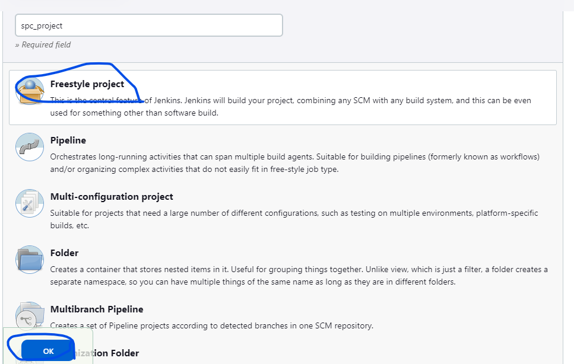
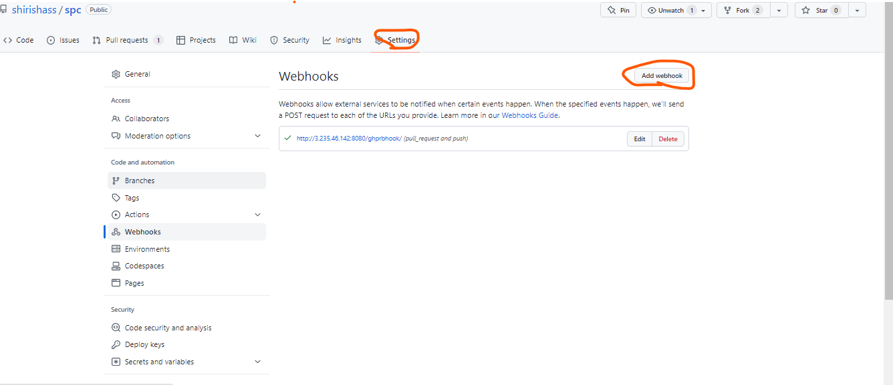
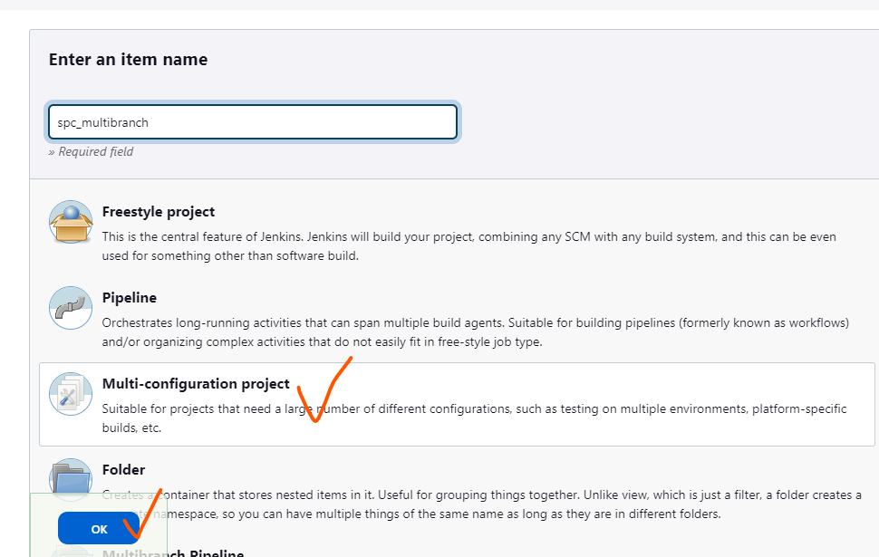
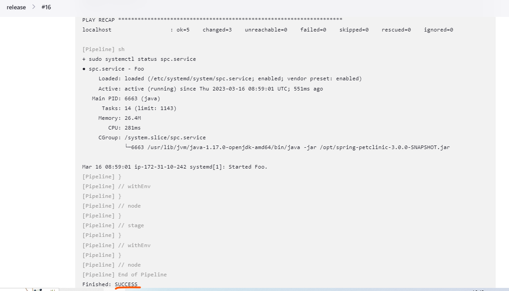

## spring petclinic
  ### manual steps: 
  * git clone https://github.com/shirishass/spc.git
  * cd spc
  * mvn package
  * java -jar target/*.jar
  ### freestyle method:
  * Take spc github project and fork the repository create feature branch in your repository
    write a jenkins pipeline for spring petclinic project in feature branch
  * If any changes are done then send a pull request to main branch then admin of that repository can accept your        request  instead of merging they check and run your pipeline after that only they merge.

```
pipeline {
    agent {label 'siri'} 
    stages {
        stage('vcs') { 
            steps {
                git url: 'https://github.com/shirishass/spc.git',
                branch: 'develop'
            } 
        }       
        stage('package') {
            steps {
                sh 'mvn package'
            }
        } 
        stage('post build') {
            steps {
                archiveArtifacts artifacts: '**/target/spring-petclinic-3.0.0-SNAPSHOT.jar',
                                 onlyIfSuccessful: true
                junit testResults: '**/surefire-reports/TEST-*.xml'
            }
        }  
    }
}   
```

 * Send pull request to targetted repository 
 * Take master vm and install java , maven & jenkins
 * For jenkins installtion [refer here](https://www.jenkins.io/doc/book/installing/linux/)
 * After login into jenkins create a freestyle project
 
 * Click on Manage jenkins → Manage Credentials and give credentials for node
 * Give a connection between github and jenkins through credentials with github token for that generate a token in github
 * Go to settings in github → developer settings → personal access token → generate token
 * By using the token add credetials in jenkins
 * Now configure the project by givinig required details
 * create a pull request in git hub
 * ensure once it automatically trigger in jenkins (it will not trigger)
 * goto manage jenkins → manage pluggins → install GitHub Pull Request Builder
 * follow this documetation for git pull request in jenkins [refer here](https://plugins.jenkins.io/ghprb/) [refer here](https://devopscube.com/jenkins-build-trigger-github-pull-request/).

### webhooks:
 * Webhooks allow external services to be notified when certain events happen
 * It is used to trigger the github events in jenkins for that go to settings in git hub repository click on webhooks add webhook give jenkins url and select git hub pull_request.
 
 * Send a pull request in github it will automatically trigger in jenkins
 * If it is success then he Merge the request

### multibranch pipeline:
 * Create Multibranch pipeline in jenkins
  
 * In multi branch pipeline all branches in your repository will run automatically
 * Create two branches develop and release
 * In develop branch write a declarative pipeline for build the project
 * build the project by using mvn package command
```
 pipeline {
    agent {label 'siri'} 
    stages {
        stage('vcs') { 
            steps {
                git url: 'https://github.com/shirishass/spc.git',
                branch: 'develop'
            } 
        }       
        stage('package') {
            steps {
                sh 'mvn package'
            }
        } 
        stage('post build') {
            steps {
                archiveArtifacts artifacts: '**/target/spring-petclinic-3.0.0-SNAPSHOT.jar',
                                 onlyIfSuccessful: true
                junit testResults: '**/surefire-reports/TEST-*.xml'
            }
        }  
    }
}   
```
* In release pipeline write a declarative pipeline for deployment of project
* deploy the project by using java -jar target/*.jar 
```
pipeline {
    agent {label 'siri'} 
        triggers { pollSCM ('* * * * *') }
    stages {
        stage('vcs') { 
            steps {
                git url: 'https://github.com/shirishass/spc.git',
                branch: 'release'
            } 
        }       
        stage('package') {
            steps {
                sh 'mvn package'
            }
        }  
        stage('post build') {
            steps {
                archiveArtifacts artifacts: '**/target/spring-petclinic-3.0.0-SNAPSHOT.jar',
                                 onlyIfSuccessful: true
                junit testResults: '**/surefire-reports/TEST-*.xml'
                stash name: 'spc',
                      includes: '**/target/spring-petclinic-3.0.0-SNAPSHOT.jar'
                }    
            }
        stage('collect file') {
            agent { label 'ansible' }
            steps {
                unstash name: 'spc'
            }
        } 
        stage('deployment') {
            agent { label 'ansible' }
            steps {
                sh 'ansible-playbook -i hosts spc.yml'
                sh 'sudo systemctl status spc.service'
            }
        }          
    }
}  
```
 * now here we have do build in one node and deployment in another node for that we use stash & unstash
    * stash is copying the files & unstash is print the copied file [refer here](https://www.jenkins.io/doc/pipeline/steps/workflow-basic-steps/#stash-stash-some-files-to-be-used-later-in-the-build)
 * for deployment purpose write a service file to project
```
 [Unit]
 Description=Foo

 [Service]
 ExecStart=/usr/lib/jvm/java-1.17.0-openjdk-amd64/bin/java -jar /opt/spring-petclinic-3.0.0-SNAPSHOT.jar

 [Install]
 WantedBy=multi-user.target
```
 * Create user in another node Install ansible [refer here](https://www.digitalocean.com/community/tutorials/how-to-install-and-configure-ansible-on-ubuntu-22-04)
 * sudo vi /etc/ssh/sshd_config
 * sudo vi /etc/sudoers
 * sudo systemctl restart sshd
 * su-jenkins
 * ssh-keygen
 * ssh-copy-id <node private ip>
 * write a ansible playbook for service file
```
- name: deploy the spring petclinic
  hosts: all
  become: yes
  vars:
    Build_file: '/home/jenkins/root/workspace/jenkinsfile_release/target/spring-petclinic-3.0.0-SNAPSHOT.jar'
  tasks:
    - name: jar file
      ansible.builtin.copy:
        src: "{{Build_file}}"
        dest: "/opt/spring-petclinic-3.0.0-SNAPSHOT.jar"
    - name: copy spc.file 
      ansible.builtin.copy:
        src:  spc.service
        dest: /etc/systemd/system/spc.service
    - name: service file
      ansible.builtin.file:
        path: /etc/systemd/system/spc.service
        mode: '0644'
        state: file 
    - name: starting spc.file
      ansible.builtin.systemd:
        name: spc.service
        enabled: yes
        state: started   
```
 * now node private ip added in inventory file vi hosts
 * these all playbook and hosts file service file all are kept in release branch
 * run the multibranch pipeline then get the output.
 
 * now browsw in web nodeip and port:8080 we see the spring petclinic page


